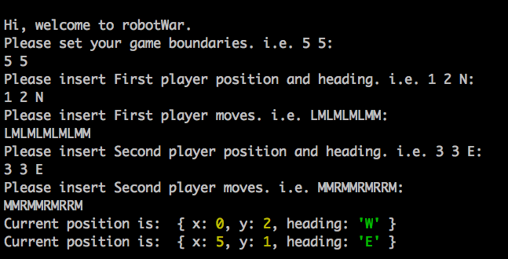
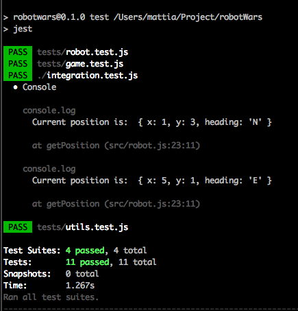

# Robot War Game

Robot War is a game that runs in [Node REPL](https://nodejs.org/api/repl.html) that let's you move
robots within a game area.

## Approach

I have used [readline-sync](https://github.com/anseki/readline-sync) to gather the player inputs in the CLI and [Jest](https://jestjs.io/) for **unit** and
**integration** tests.

To develop the game, I tried to keep each object as dumb as possible, by using pure functions.
This approach allows to add new features without changing the existing behaviour.

I have created two objects to handle the game, **Robot** and **Game** objects.
The Robot concerns only about its current position and how to move around,
instead the Game knows only about the game boundaries.

## Games rules

The robot start playing by setting the stating position rappresented by two integers (X and Y axis) and where the robot is heading to, i.e. N for nord, S for south, W for west and E
for east.

Once you have decided the starting position you can move it by using:
 - **M**: to move the robot one step
 - **L**: to rotate it towards left
 - **R**: to rotate it towards right

## How to run the project

#### Clone the project:
```
https://github.com/Mattia46/robotWars.git
```
#### Install the dependencies
```
npm i
```
#### Start the game:

```
npm start
```

You will be prompt with a guide once you start the game as follow:



#### Run tests
```
npm t
```




